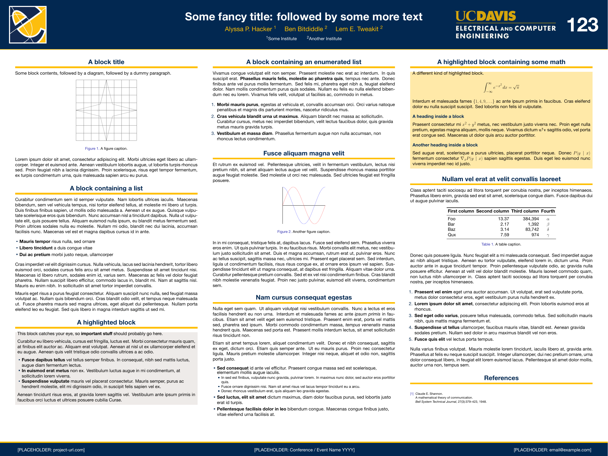

# Academic Poster Template (LaTeX, 4:3)

A clean, ready-to-edit **LaTeX research poster** for a generic scientific report.
Drop in your title, figures, and text and you have a conference-ready poster.
Everything in this repo is **filler content** (lorem ipsum, placeholder figures,
dummy tables) so nothing needs to be deleted before you start — just replace.



---

## Features

- **4:3 aspect ratio** (120 cm × 90 cm) — fills the sheet edge to edge.
- **Three-column scientific-report layout** with a full-width **Abstract** banner,
  numbered sections, a highlighted **Key Finding** callout, **References**, and
  **Acknowledgements**.
- **Placeholder figure boxes** via a one-line `\phfig{}` command — no image files
  required to start.
- **Self-contained**: the two theme `.sty` files are bundled, so it compiles on
  Overleaf or any local TeX Live without extra installs.
- **Graceful font fallback**: prefers Raleway/Lato, falls back to TeX Gyre Heros /
  Helvetica Neue if those Google Fonts aren't installed.

---

## Quick start

### Overleaf (easiest)
1. Upload this folder (or import the repo) to a new Overleaf project.
2. **Menu → Settings → Compiler → XeLaTeX** (required — the theme uses `fontspec`).
3. Compile `main.tex`.

### Local
Requires a TeX distribution (TeX Live / MacTeX) with `xelatex`:

```bash
latexmk -xelatex main.tex
# or:  xelatex main.tex
```

> **Compile with XeLaTeX or LuaLaTeX**, not pdfLaTeX — `fontspec` requires it.

---

## What to edit

All edit points live in the preamble of `main.tex` and are marked `[PLACEHOLDER ...]`.

| Element | Where | Notes |
|---|---|---|
| Title | `\title{...}` | Top center |
| Authors | `\author{... \and ... \and ...}` | `\and` separates authors |
| Advisors / mentors | `\institute{...}` | Two centered lines |
| Footer (URL, event, email) | `\footercontent{...}` | Left / center / right |
| Institution banner | `banner.png` | Shown top-right; swap in your own |
| Optional org/lab logo | `\logoleft{...}` | Commented out by default |
| Body content | inside `\begin{frame}` | Replace all lorem-ipsum |

### Placeholder figures

```latex
\phfig{<width_cm>}{<height_cm>}{<label>}
```

Renders a bordered grey box with crossed diagonals and a centered label. Replace each
one with `\includegraphics[...]{your_figure.pdf}` when your real figures are ready.

### Changing the colors

Brand colors are defined in **`beamercolorthemeucdavis.sty`** (e.g. `aggieblue`,
`aggiegold`). Edit those `\definecolor` lines, or write your own
`beamercolorthemeNAME.sty` and switch `\usecolortheme{NAME}` in `main.tex`.

### Changing the size / ratio

In `main.tex`:

```latex
\usepackage[size=custom,width=120,height=90,scale=1.0]{beamerposter}
```

`width:height = 4:3`. For a different size keep the ratio (e.g. `width=96,height=72`)
or change it to whatever your venue requires.

---

## Files

| File | Purpose |
|---|---|
| `main.tex` | The poster source — **edit this** |
| `beamerthemegemini.sty` | Layout theme (header, blocks, footer) |
| `beamercolorthemeucdavis.sty` | Color theme — **edit for your palette** |
| `banner.png` | Institution banner (top-right) — **replace** |
| `preview.png` | Rendered preview shown above |
| `main.pdf` | Compiled example output |

---

## Credits

Built on the [Gemini](https://github.com/anishathalye/gemini) beamer poster theme by
Anish Athalye and inspired by Rylan Schaeffer's
[Stanford LaTeX Poster Template](https://github.com/RylanSchaeffer/Stanford-LaTeX-Poster-Template).
The bundled color theme is adapted for these.

## License

Released under the **MIT License** — see upstream theme licenses for the bundled
`.sty` files. Replace `banner.png` with your own institution's artwork before
redistributing.
